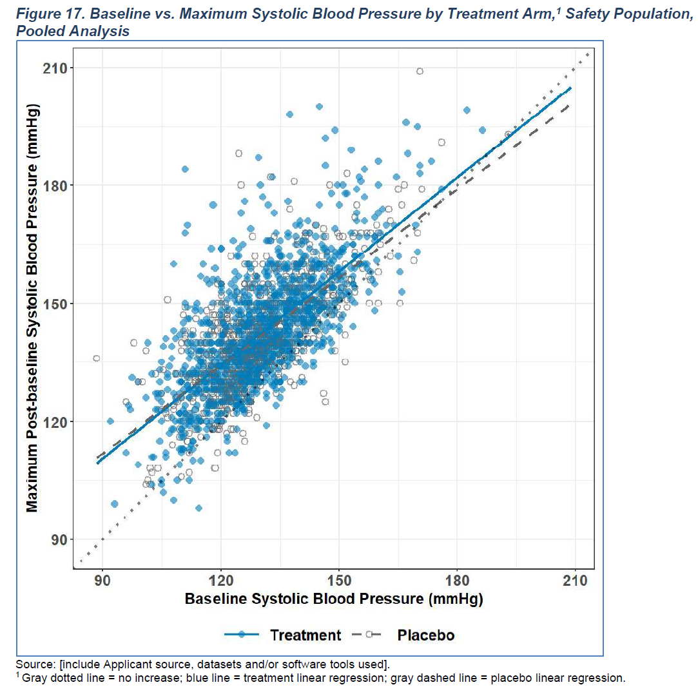

### Scatter Plot
#### Overview
This article will demonstrate how to construct a scatter plot in ggplot2. We will use a sample figure from the recent [Standard Safety Tables and Figures: Integrated Guide](https://downloads.regulations.gov/FDA-2022-N-1961-0002/attachment_1.pdf) released by the FDA as a guide. 

```{r out.height = "460px", out.width='800px', echo=F, fig.cap = "Sample figure from the SSTFIG (Figure 17)"}

```
 
#### Packages and Sample Data
Let's start with accessing ADVS from the PhUSE Test Data Factory repository.

```{r, message = FALSE, warning = FALSE, error = FALSE}
# Packages
library(ggplot2)
library(dplyr)

# Data
advs <- haven::read_xpt(
  paste0("https://github.com/phuse-org/TestDataFactory/",
         "raw/main/Updated/TDF_ADaM/advs.xpt"))
```

#### Data Wrangling
In order to make this example meaningful, data wrangling and processing steps will be covered here. In practice, you might have other considerations or processing steps that need to be considered.

The first step is to obtain baseline values for each USUBJID for the parameter and analysis time point of interest. 
```{r message = FALSE, warning = FALSE, error = FALSE}
baseline <- advs %>%
  filter(
    SAFFL == "Y",
    PARAMCD == "SYSBP",
    ATPT == "AFTER LYING DOWN FOR 5 MINUTES",
    TRTA != "Placebo"
  ) %>%
  dplyr::select(USUBJID, TRTA, BASE) %>%
  distinct(USUBJID, .keep_all = TRUE)
```

The next step is to obtain the maximum value for each USUBJID post-baseline for the same parameter and analysis time point of interest.
```{r message = FALSE, warning = FALSE, error = FALSE}
post <- advs %>%
  filter(
    SAFFL == "Y",
    PARAMCD == "SYSBP",
    ATPT == "AFTER LYING DOWN FOR 5 MINUTES",
    TRTA != "Placebo",
    AVISIT != "Baseline"
  ) %>%
  dplyr::select(USUBJID, AVAL) %>%
  group_by(USUBJID) %>%
  arrange(desc(AVAL)) %>%
  slice(1) %>%
  ungroup()
```

The last step is to merge these two data frames together.
```{r message = FALSE, warning = FALSE, error = FALSE}
all <- baseline %>%
  left_join(post)
```

The resulting data frame should look like this. 
```{r echo = F}
all %>% 
  head(n=5) %>%
  kableExtra::kable(align = 'c')
```

#### Basic Plot
Now that we have some data, we can start with a basic scatter plot.
```{r message = FALSE, warning = FALSE, error = FALSE}
ggplot(data = all, aes(x = BASE, y = AVAL)) +
  geom_point()
```

#### Customized Plot
We have a few customization to be included in order to match the figure provided in the SSTFIG. Below we separate the code and annotations in two different steps for clarity.

Let's setup the plot annotations first. This includes headers, footers, and axis text.
```{r message = FALSE, warning = FALSE, error = FALSE}
yaxis_text <- "\nMaximum Post-baseline Systolic Blood Pressure (mmHg)\n"
xaxis_text <- "\nBaseline Systolic Blood Pressure (mmHg)"
header <- "Figure 17. Baseline vs. Maximum Systolic Blood Pressure by Treatment Arm, Safety Population¹, Pooled Analysis\n"
footer1 <- "Source: [include Applicant source, datasets and/or software tools used]."
footer2 <- "¹Gray dotted line = no increase; blue line = high-dose treatment linear regression; orange dashed line = low-dose linear regression."
```

Next, let's extend our basic plot to include customizations we desire. One notable customization involves the use of `stat_smooth()`. This function will automatically compute the linear regressions for each treatment arm and append the lines of best fit to the plot.
```{r message = FALSE, warning = FALSE, error = FALSE, fig.fullwidth=TRUE, fig.width=12, fig.height=10}
f17 <- ggplot(all, aes(x = BASE, y = AVAL, linetype = TRTA)) +
  geom_point(colour = "black", shape = 21, size = 4, alpha = 0.6, aes(fill = TRTA)) +
  stat_smooth(method = "lm", se = FALSE, aes(color = TRTA)) +
  scale_color_manual(values = c("skyblue", "orange")) +
  scale_fill_manual(values = c("skyblue", "orange")) +
  geom_abline(intercept = 0, slope = 1, size = 1, lty = "dotted", color = "#5A5A5A") +
  scale_x_continuous(breaks = seq(90, 210, 30), limits = c(90, 210)) +
  scale_y_continuous(breaks = seq(90, 210, 30), limits = c(90, 210)) +
  labs(
    y = yaxis_text,
    x = xaxis_text,
    title = header,
    caption = paste(footer1, footer2, sep = "\n")
  ) +
  theme_light() +
  theme(
    panel.background = element_rect(fill = NA, color = "skyblue3", size = 2, linetype = "solid"),
    plot.caption = element_text(hjust = 0),
    legend.position = "bottom",
    legend.title = element_blank(),
    axis.text = element_text(face = "bold")
  ) 

f17
```

#### Confirmation
Using `stat_smoooth()` is a handy shortcut to achieve what we wanted. We should take some care to verify the results of this function are inline with what we expect. We can achieve this by manually running an `lm()`.

```{r message = FALSE, warning = FALSE, error = FALSE}
coef <- all %>%
  filter(TRTA == "Xanomeline High Dose") %>%
  lm(data = ., AVAL ~ BASE) %>%
  coefficients()

coef
```

The next step is to see if this is congruent with what `stat_smooth()` provided in our plot. We'll plot the coefficients and check whether they overlap, which would indicate they are similar.
```{r message = FALSE, warning = FALSE, error = FALSE}
all %>%
  filter(TRTA == "Xanomeline High Dose") %>%
  ggplot(., aes(x = BASE, y = AVAL)) +
  geom_point() +
  stat_smooth(method = "lm", se = FALSE, size = 5) +
  geom_abline(intercept = coef[[1]], slope = coef[[2]], color = "red")
```

Looks okay!

#### More faithful aesthetics
While the above plot matched the technical specification, it did differ in a few aesthetics namely colors, and the border of the main plot. Below is code to achieve a closer aesthetic match with what's in the SSTIF for the interested.

Line spaces have been removed from the beginning and end of text.
```{r message = FALSE, warning = FALSE, error = FALSE}
# setup plot text
yaxis_text_alt <- "Maximum Post-baseline Systolic Blood Pressure (mmHg)"
xaxis_text_alt <- "Baseline Systolic Blood Pressure (mmHg)"
header_alt <- "Figure 17. Baseline vs. Maximum Systolic Blood Pressure by Treatment Arm, Safety Population¹, Pooled Analysis"
footer1_alt <- "Source: [include Applicant source, datasets and/or software tools used]."
footer2_alt <- "¹Gray dotted line = no increase; blue line = high-dose treatment linear regression; grey dashed line = low-dose linear regression."
```

Colors and border contexts have changed. Title/footers have been re-factored using `patchwork::plot_annotation()`
```{r message = FALSE, warning = FALSE, error = FALSE, fig.fullwidth=TRUE, fig.width=12, fig.height=10}
f17_alt <- ggplot(all, aes(x = BASE, y = AVAL, linetype = TRTA)) +
  geom_point(colour = "black", shape = 21, size = 4, alpha = 0.6, aes(fill = TRTA)) +
  stat_smooth(method = "lm", se = FALSE, aes(color = TRTA)) +
  scale_color_manual(values = c("skyblue", "grey")) +
  scale_fill_manual(values = c("skyblue", "white")) +
  geom_abline(intercept = 0, slope = 1, size = 1, lty = "dotted", color = "#5A5A5A") +
  scale_x_continuous(breaks = seq(90, 210, 30), limits = c(90, 210)) +
  scale_y_continuous(breaks = seq(90, 210, 30), limits = c(90, 210)) +
  labs(
    y = yaxis_text_alt,
    x = xaxis_text_alt
  ) +
  theme_bw() +
  theme(
    plot.background = element_rect(fill = NA, color = "skyblue3", size = 2, linetype = "solid"),
    legend.position = "bottom",
    legend.title = element_blank(),
    axis.text = element_text(face = "bold")
  ) 

# Use the patchwork package to specify title, caption (e.g. footers) and footers position (i.e. left align) to get a closer aesthetic feel.
library(patchwork)
f17_alt + patchwork::plot_annotation(title = header_alt,
                                     caption = paste(footer1_alt, footer2_alt, sep = "\n"),
                                     theme = theme(plot.caption = element_text(hjust = 0)))
```