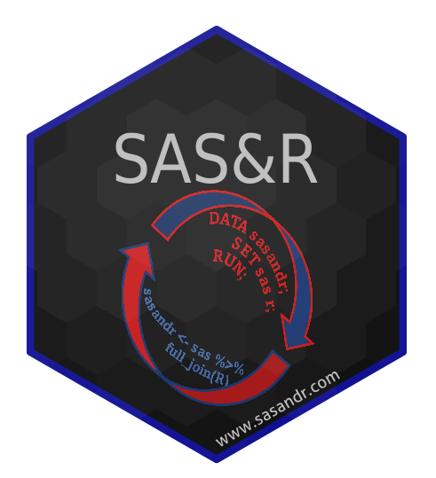

--- 
title: "SAS and R"
author: "Bayer Oncology SBU"
site: bookdown::bookdown_site
documentclass: book
url: https://docs.int.bayer.com/-/ocs.sas2r/
link-citations: yes
github-repo: bayer-int/ocs.sas2r
---

# Welcome

    The intent of this book is to provide a knowledge hub of using R in a clinical study context. 

We aim to make the transition from SAS to R as effortless as possible. Therefore, in addition to explanations of the processes, we try to focus on code that could be relevant in the context of clinical studies.

All code snippets can be used independently, they just need to be adjusted to your data. The catalog is likely not to be exhaustive as we see it more as a living document for which we encourage cross-industry collaboration.

If you would suggest any content be added or amended, or have questions or feedbacks, we kindly request that you [open an issue](https://github.com/bayer-int/ocs.sas2r/issues). The current maintainer is [Siqi Zhang](https://github.com/iqis).